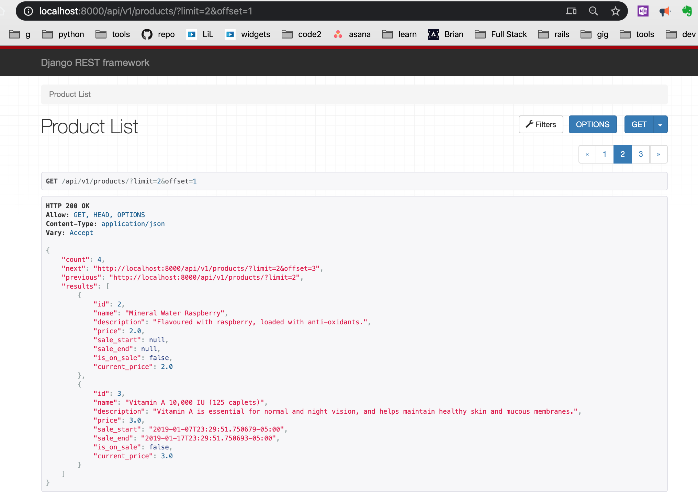

sidecar-django-rest-store

# create env

python3 -m venv venv\_django\_rest\_store

# activate env

source venv\_django\_rest\_store/bin/activate

# install django

pip install django

* 
* 'Installing collected packages: asgiref, sqlparse, pytz, django'
* WARNING: You are using pip version 19.2.3, however version 20.0.2 is available.
* You should consider upgrading via the 'pip install --upgrade pip' command.
* 
*

pip install djangorestframework

*

pip install django-filter

# add 'django\_filters' to your INSTALLED\_APPS.

*

pip install pillow

# add '127.0.0.1' to allowed\_hosts in setttings.py

*

▶ pip install mock==0.8.0

*

▶ python3 manage.py makemigrations

▶ python3 manage.py migrate

* Operations to perform:
* Apply all migrations: admin, auth, contenttypes, sessions, store
* Running migrations:
* Applying auth.0010\_alter\_group\_name\_max\_length... OK
* Applying auth.0011\_update\_proxy\_permissions... OK

# access the db using the python shell

▶ ./manage.py shell

# import modules

> > > from store.models import Product
> > > product = Product.objects.all()[0]
> > > from store.serializers import ProductSerializer
> > > serializer = ProductSerializer()
> > > data = serializer.to\_representation(product)
> > > from rest\_framework.renderers import JSONRenderer
> > > renderer = JSONRenderer()
> > > print(renderer.render(data))

* b'{
"id":1,
"name":"Mineral Water Strawberry!",
"description":"Natural-flavored strawberry with an anti-oxidant kick.","price":1.0,"sale\_start":null,"sale\_end":null,"is\_on\_sale":false,"current\_price":1.0}'
*

filter- full-text search filter backend
     import [SearchFilter] 
     add [SearchFilter] to ProductList
    search fields
    
    
    Pagination
    

http://localhost:8000/api/v1/products/?limit=2&offset=1
    
    